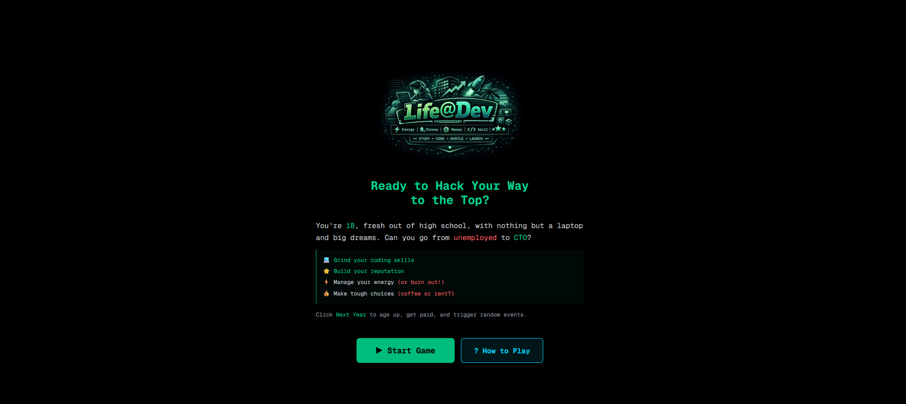
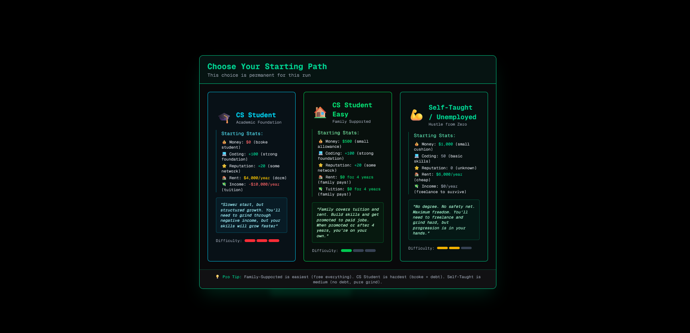

<div align="center">
  

# Life@Dev

### 🎮 Survive the Grind. Climb the Ladder. Build Your Legacy.

[](https://github.com/your-repo/life-at-dev)
[](LICENSE)
[](https://nextjs.org/)
[](https://react.dev/)
[](https://www.typescriptlang.org/)

**A strategic life simulation game where you navigate the challenging journey of a software developer's career from student to tech veteran.**

Make critical decisions, manage your resources wisely, build your skills strategically, and discover multiple paths to success—including hidden easter eggs for the most strategic players!

[Features](#-features) • [Contributing](CONTRIBUTING.md) • [License](LICENSE)

</div>

---

## 📖 Table of Contents

- [About](#-about-the-game)
- [Screenshots](#-screenshots)
- [Features](#-features)
- [Game Mechanics](#-game-mechanics)
- [Actions & Strategies](#-actions--strategies)
- [Tech Stack](#️-tech-stack)
- [Contributing](#-contributing)
- [License](#-license)
- [Credits](#-credits)

---

## 🎯 About The Game

**Life@Dev** is an immersive career simulation game that captures the real challenges and triumphs of being a software developer. Starting from your choice of either a traditional CS degree path or a self-taught bootcamp journey, you'll face realistic decisions about how to spend your limited time each week.

### Why Play Life@Dev?

- **🎓 Educational**: Learn about different career paths in tech
- **📊 Strategic**: Plan your moves carefully - every week counts
- **🌟 Realistic**: Based on real-world developer career progression
- **🎨 Engaging**: Beautiful UI with smooth animations and responsive design
- **🏆 Replayable**: Multiple paths and endings to discover

---

## 🖼️ Screenshots

<div align="center">
  
  <p><em>🏠 Start Screen - Choose your path and begin your journey</em></p>
  <br/>

  
  <p><em>🎓 Path Selection - CS Student with Family Support or Self-Taught Bootcamp</em></p>
  <br/>

  
  <p><em>💼 Gameplay - Manage your career, skills, and life balance</em></p>
</div>

---

## ✨ Features

### 🎮 Core Gameplay

- **🛤️ Multiple Starting Paths**:
  - **CS Student (Family Supported)**: Easiest start - family covers tuition and rent for 4 years
  - **CS Student (Self-Funded)**: Medium difficulty - pay $10K/year tuition + $4K/year rent
  - **Unemployed/Bootcamp Graduate**: Hardest start - learn to hustle, freelance, and survive

- **⏰ Time-Based Progression**:
  - Each year consists of 52 weeks
  - Actions cost weeks and resources
  - Plan carefully - time is your most precious resource

- **🎯 Action-Based System**:
  - Build side projects (3 weeks)
  - Grind LeetCode (1 week)
  - Network online (1 week)
  - Freelance gigs (4 weeks)
  - Attend hackathons (2 weeks)
  - And many more strategic choices!

- **⚡ Resource Management**:
  - **Energy**: Depletes with actions, recover through rest
  - **Stress**: Increases with work, manage carefully to avoid burnout
  - **Money**: Earn through jobs and freelancing, spend on rent and upgrades
  - **Coding Skill**: Scale from 0-1000 through practice and experience
  - **Reputation**: Build through networking, open source, and achievements

- **🎓 Progressive Career System**:
  - Auto-promotions at junior/mid levels
  - Manual job hunting at senior+ for strategic career pivots
  - 6+ distinct career paths with unique progression

### 💼 Career Paths

| Path                    | Starting Point      | Key Positions                  | Peak Role            | Salary Range  |
| ----------------------- | ------------------- | ------------------------------ | -------------------- | ------------- |
| **🏢 Corporate Ladder** | CS Student → Intern | Junior → Mid → Senior Dev      | Senior Developer     | $60K - $140K  |
| **👔 Management Track** | From Senior Dev     | Team Lead → Eng Manager        | CTO                  | $160K - $300K |
| **👨‍💻 IC Track**         | From Senior Dev     | Staff → Principal              | Distinguished Fellow | $200K - $400K |
| **💼 Hustler Path**     | Unemployed          | Script Kiddie → Freelancer     | Digital Nomad        | $5K - $75K    |
| **🚀 Business Track**   | From Hustler        | Agency Owner → Tech Influencer | Tech Mogul           | $120K - $1M   |
| **🔒 Specialist Track** | From Hustler/Senior | Contractor → Consultant        | Industry Architect   | $180K - $2M   |

### 📊 Game Systems

- **📅 52-Week Years**: Realistic annual progression with year-end reviews
- **📈 Stat Scaling**: Long-term progression with 0-1000 scale for coding and reputation
- **💰 Dynamic Income**: Freelance payouts and salaries scale with your skills
- **🎯 Smart Promotions**: Strategic job changes unlock new opportunities
- **👨‍👩‍👧 Family Support**: Financial safety net for CS Student path (first 4 years)
- **🎲 Random Events**: Unexpected opportunities and challenges
- **🎤 AI Interviews**: Practice interviews with AI-generated questions
- **🎉 Multiple Endings**: Different outcomes based on your career choices

### 🌟 Special Features

- **🥚 Easter Eggs**: Discover hidden achievements
- **📱 Responsive Design**: Play on desktop, tablet, or mobile
- **🎨 Modern UI**: Clean, professional interface with smooth animations
- **⚡ PWA Ready**: Progressive Web App structure (offline support coming soon)
- **💾 Save**: Game state persistence with manual save option
- **📊 Career Statistics**: Track your lifetime earnings and progress

## 🎲 Game Mechanics

### Resource System

```
Energy (0-100)
├─ Depletes when taking actions
├─ Recover through rest and self-care
└─ Required for all productive activities

Stress (0-100)
├─ Increases with work and challenges
├─ Reduce through self-care and breaks
└─ High stress leads to burnout (game over at 100)

Money ($)
├─ Earn through jobs and freelancing
├─ Spend on rent and investments
├─ Can go negative (debt) but risky
└─ Bankruptcy at year-end if unable to cover expenses

Coding Skill (0-1000)
├─ Improve through practice and work
├─ Unlocks better job opportunities
└─ Scales freelance income

Reputation (0-1000)
├─ Build through networking and achievements
├─ Opens doors to better positions
└─ Increases freelance rates
```

### Weekly Action System

Each action costs:

- **Weeks**: Time investment (1-4 weeks)
- **Energy**: Effort required (5-60 points)
- **Stress**: Mental toll (5-40 points)
- **Money**: Sometimes required for investments and shop

Each action provides:

- **Coding Skill**: Technical improvement
- **Reputation**: Professional network growth
- **Money**: Direct income
- **Special Effects**: Unlock new paths or opportunities

### Year-End System

At the end of each year:

- **📊 Performance Review**: See your annual progress
- **💰 Salary/Financial Summary**: Review earnings vs expenses
- **📈 Promotion Check**: Eligible for advancement?
- **🎯 Career Suggestions**: Recommendations for next steps
- **🎉 Achievements**: Unlock special milestones

## 🚀 Actions & Strategies

### Work Actions (Build Your Skills)

| Action                | Weeks | Energy | Coding | Reputation | Money     |
| --------------------- | ----- | ------ | ------ | ---------- | --------- |
| 🧮 Grind LeetCode     | 1     | 15     | +5     | 0          | 0         |
| 🛠️ Build Side Project | 3     | 30     | +8     | +5         | 0         |
| 💼 Freelance Gig      | 4     | 25     | +10    | +2         | Dynamic\* |
| 🏆 Attend Hackathon   | 2     | 40     | +20    | +5         | 0         |

\*Freelance income scales with your coding skill and reputation

### Social Actions (Build Your Network)

| Action            | Weeks | Cost | Effect         |
| ----------------- | ----- | ---- | -------------- |
| 🌐 Network Online | 1     | $100 | +10 reputation |

### Self-Care Actions (Manage Resources)

| Action         | Weeks | Effect                  |
| -------------- | ----- | ----------------------- |
| 😴 Sleep In    | 1     | +50 energy, -10 stress  |
| 🏝️ Touch Grass | 3     | +100 energy, -50 stress |

## 🛠️ Tech Stack

- **[Next.js 16.1](https://nextjs.org/)** - React framework with App Router
- **[React 19.2](https://react.dev/)** - Latest React with concurrent features
- **[TypeScript 5](https://www.typescriptlang.org/)** - Type-safe development
- **[Tailwind CSS 4](https://tailwindcss.com/)** - Utility-first CSS framework
- **[Google Gemini AI](https://ai.google.dev/)** - AI-powered interview generation
- **[Appwrite](https://appwrite.io/)** - Backend-as-a-Service
- **[ESLint](https://eslint.org/)** & **[Prettier](https://prettier.io/)** - Code quality tools

## 💡 Tips & Support

### Beginner Tips

- Start with **CS Student (Family Supported)** for easier gameplay
- Balance energy and stress management carefully
- Build coding skills early through LeetCode and side projects
- Save money for career transitions
- Network consistently to build reputation

### Advanced Strategies

- Scale freelance income with high coding + reputation
- Plan strategic career pivots at the right time
- Discover easter eggs through unique action combinations
- Optimize with multi-week actions for efficiency

### Need Help?

- 🐛 [Report Issues](https://github.com/rahidmondal/life-at-dev/issues)
- 💬 [Join Discussions](https://github.com/rahidmondal/life-at-dev/discussions)

## 🤝 Contributing

We welcome contributions! Whether it's bug fixes, new features, or documentation improvements, your help is appreciated.

**Please read [CONTRIBUTING.md](CONTRIBUTING.md) for detailed guidelines.**

### Quick Guidelines

- Follow TypeScript best practices
- Use Prettier for code formatting
- Ensure ESLint passes without errors
- Add comments for complex logic
- Test your changes thoroughly

## 📄 License

This project is licensed under the **MIT License** - see the [LICENSE](LICENSE) file for details.

## 👥 Credits

### Powered By

<div align="center">
  <a href="https://nextjs.org/" target="_blank">
    
  </a>
  &nbsp;&nbsp;&nbsp;&nbsp;
  <a href="https://appwrite.io/" target="_blank">
    
  </a>
  &nbsp;&nbsp;&nbsp;&nbsp;
  <a href="https://ai.google.dev/" target="_blank">
    
  </a>
</div>

<br/>

Built with ❤️ using React, Next.js, TypeScript, Appwrite and Tailwind CSS.

---

<div align="center">

### 🌟 Star this project if you found it helpful!

Made with ❤️ by developers, for developers

**[⬆ Back to Top](#)**

</div>
