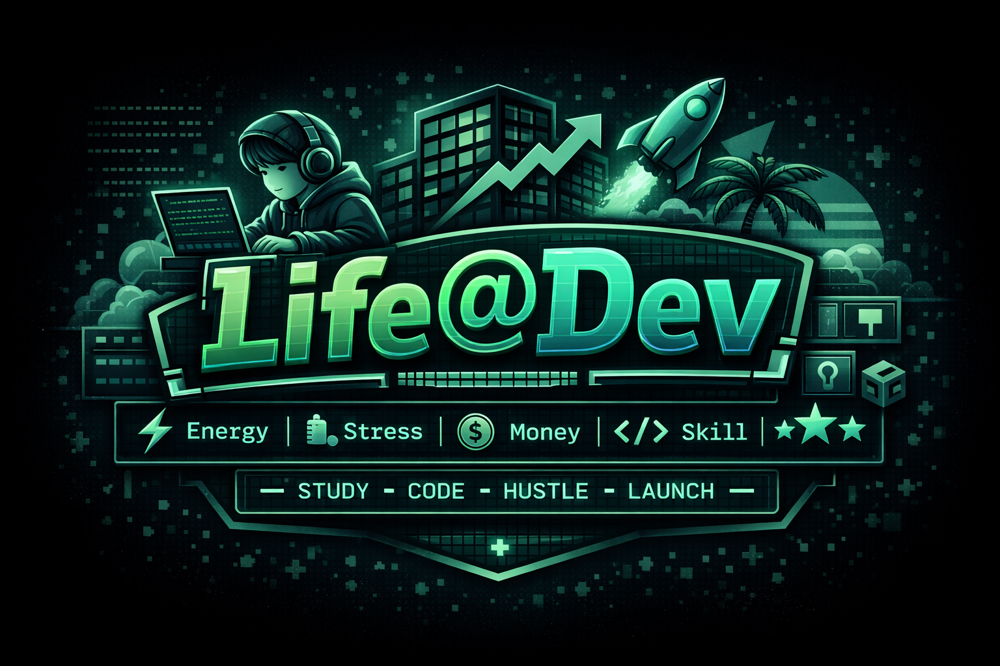

<div align="center">
  

# Life@Dev v2.0

### 🎮 Survive the Grind. Climb the Ladder. Build Your Legacy.

_"A strategic simulation where you balance code, career, and sanity on the relentless road to 10,000 hours."_

[](https://github.com/rahidmondal/life-at-dev)
[](LICENSE)
[](https://nextjs.org/)

</div>

---

## 📖 Introduction

**Life@Dev v2.0** is not just a game about coding; it's a mirror of the developer's journey. We've shifted from "Arcade" to **Strategy**. It is no longer about how fast you can click; it is about how well you can prioritize.

The game explores the tension between **Ambition** (becoming a CTO, wealth) and **Humanity** (mental health, burnout, life satisfaction). We are moving from "Number goes up" to **"Number fights back."**

---

## ⚖️ The Core Philosophy: Potential vs. Proof

In most games, reading a book makes you a master. In the real world, it just makes you "smart." Life@Dev separates a developer's worth into two distinct currencies:

- **📘 Skill (Potential)**: "Book Smarts." Gained by studying and grinding LeetCode. High skill helps you _pass the interview_.
- **🏆 XP (Proof)**: "Street Smarts." Gained by shipping code, fixing production bugs, and surviving crunch time. High XP helps you _get the promotion_.

**The Catch**: You can have 10,000 Skill but 0 XP. You are a "Paper Tiger"—brilliant in theory, useless in practice. The game forces you to convert your Potential into Proof before you burn out or age out.

---

## ⏳ The Gameplay Loop

The simulation follows your career across four distinct acts, each with its own economic reality and strategic focus:

### 1. The Prologue: Education & Debt

_Age 18-22_
Define your origin story. Do you take the **Scholarship** (Debt-free but no experience), the **Self-Funded** path (High Skill, Massive Debt), or the **Street Path** (Zero Skill, but you start earning 4 years early)?

### 2. The Grind: Survival

_Age 22-30_
The reality of rent hits to hit hard. The goal is survival. You catch-22 is painful: you need to study to get hired, but you need to work menial gigs to pay rent. Every dollar counts.

### 3. The Plateau: Strategy & Politics

_Age 30-50_
Money is no longer the issue; **Stagnation** is. The "Logarithmic Wall" hits—brute force learning stops working. You must choose your path:

- **🏢 The Corporate Ladder**: Trade autonomy for stability. Navigate office politics to become a CTO.
- **🐺 The Hustler's Path**: Trade stability for freedom. Feast or famine as a Freelancer or Founder.

### 4. The Mastery: Legacy vs. Decay

_Age 50-65_
The end game. Your enemy is **Time**.

- **Entropy (Rust)**: Your skills decay every week. The higher your stats, the faster they drop. You must run just to stay in place.
- **The End**: Do you die rich but alone? Retire to a farm? or become a Legend who changed the world?

---

## ⚙️ Core Mechanics

### The Ledger

We treat your stats not as scores, but as bank accounts you must balance:

- **💰 Money**: The enabler. Buys time and education.
- **⚡ Energy**: The currency of the week. Do you sleep, code, or network?
- **❤️ Stress**: The limiter. Push comfortably into the "High Performance" zone (50-80), but touch the "Danger Zone" (>80) and risk **Burnout**.

### Career Architecture

Your career is a directed graph, not a ladder.

- **Pivots**: Switching from Corporate to Hustler (or vice versa) is the most strategic move you can make.
- **The Pivot Penalty**: You keep your **Skill** (you still know how to code), but you lose your **XP** (your "Years at Google" mean nothing to a client who just wants a website).

### The Living World

The game reacts to _who_ you are.

- **[Broke]**? Desperation gigs unlock.
- **[BurnedOut]**? You might snap at your boss.
- **[Overqualified]**? Recruiters try to poach you.

---

## 🛠️ Tech Stack

Built with a premium modern stack for a premium experience:

- **[Next.js 16.1](https://nextjs.org/)** - App Router & Server Actions
- **[React 19.2](https://react.dev/)** - Concurrent features
- **[TypeScript 5](https://www.typescriptlang.org/)** - Strict type safety
- **[Tailwind CSS 4](https://tailwindcss.com/)** - Utility-first styling
- **[Google Gemini AI](https://ai.google.dev/)** - Powers dynamic "Boss Interviews" and "Obituaries"
- **[Appwrite](https://appwrite.io/)** - Backend & Persistence

---

## 🚀 Getting Started

### Prerequisites

- Node.js 18+
- pnpm

### Installation

```bash
# Clone the repository
git clone https://github.com/rahidmondal/life-at-dev.git

# Install dependencies
cd life-at-dev
pnpm install

# Run the development server
pnpm dev
```

Open [http://localhost:3000](http://localhost:3000) to start your journey.

---

## 🤝 Contributing

We welcome contributions! Please read [CONTRIBUTING.md](CONTRIBUTING.md) for details on our code of conduct and the process for submitting pull requests.

---

## 📄 License

This project is licensed under the MIT License - see the [LICENSE](LICENSE) file for details.

---

<div align="center">

### 🌟 Star this project if you found it helpful!

**[⬆ Back to Top](#)**

</div>
